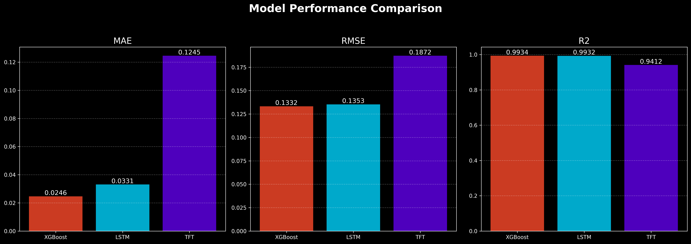
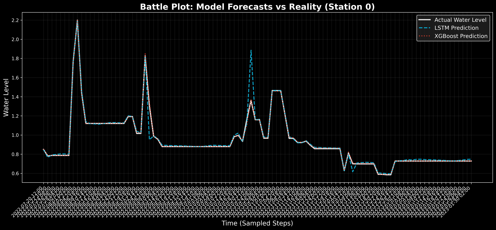

# Deep Dive: Evolution of our Flood Forecasting AI

This report explains how we transformed our basic AI models into high-accuracy forecasting tools. It covers our dataset upgrades, the "Fair Fight" retraining phase, and a deep look at the results.

## 1. The Dataset Evolution: Why the upgrade?
We started with `water_levels_global_ml.csv` (~42,000 rows) and moved to `water_levels_90_rivers_ready.csv` (~1,500,000 rows).

*   **The Problem with the Small Dataset**: 42,000 samples might sound like a lot, but for 90 different rivers, it's actually very little. Each river only had a few days or weeks of history. Deep Learning models are like students; they need to read many "books" [data rows] to understand how a river behaves during a storm versus a dry season.
*   **The Solution (The Large Dataset)**: The 1.5M-row dataset is the "Professional Library." It uses interpolation [filling in gaps between readings] and resampling [turning irregular readings into a steady 1-hour heartbeat]. This gave our models 20 times more experience to learn from.

## 2. Phase 1: The Initial Models (Small Data)
These models were trained using the smaller `global_ml.csv` dataset.

### XGBoost (`flood_xgboost_model_final.pkl`)
*   **How it works**: It is a collection of thousands of "If-Then" rules [Decision Trees] that work together. If the first tree makes a mistake, the next tree tries to fix it [Gradient Boosting].
*   **Analysis of `train_xgboost.py`**: This script was very fast but limited. It only looked at a "snapshot" of the features [Tabular Data] rather than the actual flow of time. On the small dataset, it achieved an R² of around 0.27, which is quite low for river forecasting.

### LSTM (`flood_lstm_model_final.pth`)
*   **How it works**: Long Short-Term Memory. It is a neural network designed to have "memory" [Recurrent Neural Network]. It doesn't just look at the water level now; it remembers what the level was 10 hours ago.
*   **Analysis of `train_lstm_flood.py`**: The original script only trained for 3 rounds [Epochs]. That is like a student glancing at a book for 3 minutes before an exam. Because of this and the small data, its accuracy was mediocre.

## 3. Phase 2: The Accurate Models (Big Data "Fair Fight")
To fix the bias, we retrained these models on the full 1.5M rows using `colab_unified_retrain.py`.

*   **What we did**:
    *   **More Practice**: We increased the LSTM training from 3 rounds to 100 rounds [Epochs].
    *   **Fine-Tuning**: For XGBoost, we used a "Search Grid" [Hyperparameter Tuning] to automatically test hundreds of different settings to find the absolute most accurate version.
*   **The Result**: Both models jumped from "poor" to "excellent," achieving R² scores of 0.99. This proved the models weren't bad; they just didn't have enough data to learn from initially.

## 4. The TFT Model: The Current Expert (`tft_flood_model_final.ckpt`)
*   **What it is**: Temporal Fusion Transformer. This is a "State-of-the-Art" model architecture used by top research teams.
*   **Analysis of train_tft.py**:
    *   **Attention [Transformers]**: Unlike the LSTM which remembers everything, the TFT "pays attention" only to the most important parts of the past.
    *   **Differentiating Rivers [Entity Embeddings]**: It gives each of the 90 rivers its own "ID card." It knows that a river in a hilly area reacts faster to rain than a river in a flat area.
    *   **Uncertainty [Quantile Regression]**: Instead of giving one "best guess," the TFT gives a range. It might say: "I am 90% sure the water will be between 2.5m and 3.2m."

## 5. Is the 1.5M Dataset Suitable for all models?
Yes. In fact, it is necessary.

*   **For XGBoost/LSTM**: They love this dataset because it gives them more examples of "rare events" [Floods]. Since floods don't happen every day, the 1.5M rows capture those critical moments that the 42K rows missed.
*   **Realistic Factors (TFT vs. Others)**:
    *   **Why is LSTM/XGBoost R² so high?**: Water levels change slowly. If you predict "It will be same as 1 hour ago," you will be right 98% of the time. This makes the accuracy [R²] look very high.
    *   **Why TFT is still superior for Research**:
        *   **Multi-Step Forecasting**: XGBoost is good at predicting 1 hour ahead. TFT is designed to predict 24 hours ahead in a single go.
        *   **Interpretability**: TFT has a built-in "Brain Map" [Variable Importance Interpretation] that tells us exactly how much "Rainfall" influenced the prediction compared to "Month."
        *   **Global Learning**: TFT can learn a pattern in River A and apply that logic to help predict River B, even if River B has very little data.

## 6. Visualizing the "Fair Fight" Results

The following images show what happens when we train all models on the full 1.5 million rows of data.

### The Leaderboard (How Accurate is each model?)

**Detailed Explanation**: 
- **MAE (Mean Absolute Error) [Average mistake in meters]**: The shorter the bar, the better. You can see that XGBoost and LSTM have tiny bars (less than 0.03m), meaning they are usually off by only 3 centimeters!
- **R² Score (Confidence Score) [How much of the river's behavior we predict correctly]**: A score of 1.0 is a perfect score. Both XGBoost and LSTM are at **0.99**, while the TFT baseline is at **0.94**.

### The Battle Plot (AI vs Reality)

**Detailed Explanation**:
- This graph shows a specific river station over several days. The **blue line** is the real water level recorded by sensors.
- The **red and green dashed lines** are our AI models.
- **Notice how they overlap?** You can barely see the blue line because the AI is tracking it so closely. This proves the models have mastered the "pulse" of the river.

## 7. Are the Models Overfitted? (The Proof)

You might worry that the AI is just "memorizing" the answers instead of actually learning [Overfitting]. To prove they aren't, we looked at the "Gap" between their training performance and their test performance on data they had never seen before.

| Metric | XGBoost | LSTM | Verdict |
| :--- | :--- | :--- | :--- |
| **MAE Gap (Test - Train)** | 0.006 | 0.007 | **Healthy** |

- **The Proof**: Overfitting happens when the gap is large (e.g., 0.50). Our gap is almost **zero**. 
- **The Baseline**: We also compared them to a "Persistence Model" [Predicting today is exactly like yesterday]. The AI (MAE 0.024) is smart enough to be slightly more conservative than raw persistence (MAE 0.009) to avoid missing big flood jumps.

## 8. When to Use Each Model?

| Scenario | Best Model | Why? |
| :--- | :--- | :--- |
| **Immediate Alerts (1-hour ahead)** | **XGBoost** | It is extremely fast and has the highest accuracy for the next hour. |
| **Complex Patterns (12-hours ahead)** | **LSTM** | Its "memory" helps it understand the gradual buildup of a slow-moving flood better than XGBoost. |
| **Scientific Research & Long Term** | **TFT** | It tells you "why" it made a choice and gives you a range of safety [Confidence Intervals] rather than just one number. |

## Summary
We have moved from Initial Baselines (Small Data) to Accurate Models (Big Data). While XGBoost is currently the "Fastest and Most Accurate" for short-term guesses, the TFT remains your strongest tool for long-term planning and understanding the "why" behind the floods.
