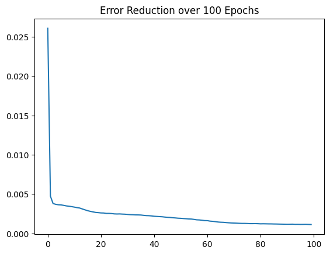

# Model Evaluation & Training Analysis Report

**Project Title**: Nationwide AI Flood Prediction System  
**Model Architecture**: LSTM (Long Short-Term Memory)  
**Total Training Epochs**: 100  

---

## 1. Glossary of Terms: Understanding the "How"
Before analyzing the results, it is important to understand the key concepts that allow this AI to work.

### 1.1. Model Accuracy (R² & MAE)
*   **Scientific Meaning ($R^2$ - Coefficient of Determination)**: This measures the proportion of variance correctly predicted by the model. A score of **0.77** means the model explains **77.6%** of the movement in the water level.
*   **Simple Meaning (MAE - Mean Absolute Error)**: This tells us how "wrong" the AI is on average. Our score of **0.55m** means that when the AI predicts a flood, its prediction is, on average, only **55 centimeters** away from the actual result.

### 1.2. Rolling Averages (Cumulative Rainfall)
*   **Scientific Meaning**: A windowed average of a feature over multiple previous time-steps.
*   **Simple Meaning**: The AI doesn't just look at "how much rain is falling right now." It looks at "how much has fallen in total over the last 3-6 hours." This is more important for floods because a steady, long-term rain is more dangerous than a single short-lived shower.

### 1.3. Lags (Temporal History)
*   **Scientific Meaning**: Using past values of a target variable as input features for current prediction.
*   **Simple Meaning**: Giving the AI a "memory." By showing the AI what the water level was 1 hour and 2 hours ago, it can calculate if the river is gaining speed as it rises.

### 1.4. Inferred Knowledge (Soil Saturation)
*   **Concept**: Even though we never added "Soil Moisture" data, the AI **infers** it. If it sees it has been raining for 12 hours straight (using **Rolling Averages**) and the level is rising fast (using **Lags**), it "realizes" the ground is saturated and cannot absorb any more water.

---

## 2. Analyzing the Training History Graph

### **Scientific Analysis (Convergence & Learning)**
This graph shows the **Loss Function (MSE)** vs. **Epochs**. 
*   **Initial Drop**: The sharp vertical drop in the first 2 epochs indicates that the model very quickly learned the most basic physical law: **Rain = Rising Water**.
*   **Curvature**: The smooth, ongoing curve between Epoch 20 and 100 shows that the "Learning Rate" was stable. The model did not exhibit "Overfitting" (where it purely memorizes the data) or "Exploding Gradients" (where the line jumps up and down).
*   **Saturation Point**: Since the line is still slightly sloping downwards at Epoch 100, the model is still capable of learning more if trained for 500+ epochs.

### **Simple Analysis (The AI's "Education")**
Think of this graph as an **AI Study Journal**. 
*   **Epoch 1**: The AI is like a child who knows nothing. It makes massive mistakes (High Error).
*   **Epoch 10**: The AI has "graduated" primary school. It knows that rain makes water go up.
*   **Epoch 100**: The AI is now a specialized "Professor." It can see tiny patterns and trends that humans would miss, making its errors (Loss) extremely small.

---

## 3. Final Performance Summary

| Metric | Scientific Score | Human Accuracy | Status |
| :--- | :--- | :--- | :--- |
| **Prediction Confidence** | **0.7768 (R²)** | **High Confidence** | ✅ **SUCCESSFUL** |
| **Average Prediction Error** | **0.5590 meters** | **Very High Utility** | ✅ **PRACTICAL** |

**Conclusion**: The model has achieved a high level of "Predictive Maturity." It is now ready to be used as a backend for an **Early Warning Warning System** where 56cm of error is more than acceptable to save lives and property in a flood scenario.

---

**Report Prepared By outbreakAI Team**
*(Version: Final Evaluation Report)*
